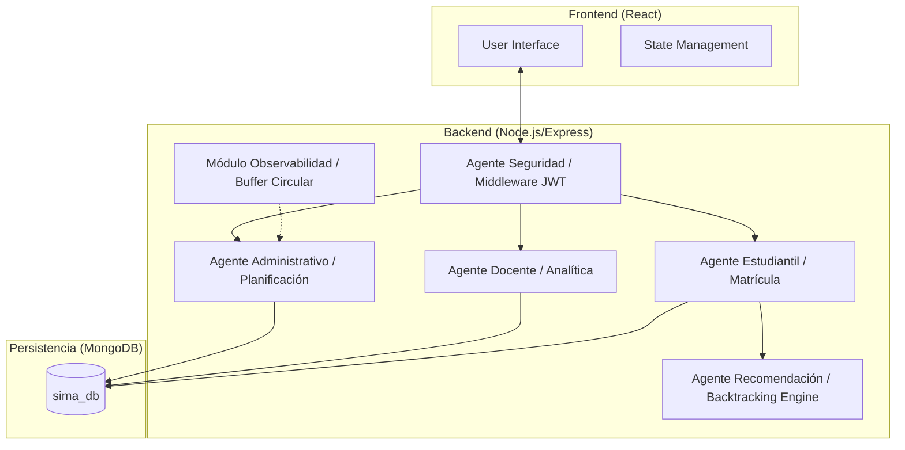

# Arquitectura del Sistema SIMA

El Sistema Integral de Matrícula Académica (SIMA) está diseñado bajo una arquitectura de **Agentes Lógicos** desacoplados, implementada sobre un stack **MERN** (MongoDB, Express, React, Node.js).

## Vista General

El sistema se divide en tres capas principales:

1.  **Capa de Presentación (Frontend)**: Interfaz reactiva en React + Vite, optimizada para dashboards administrativos y portales estudiantiles.
2.  **Capa de Aplicación (Backend)**: Servidor Node.js/Express que orquesta la lógica de negocio a través de controladores especializados (Agentes).
3.  **Capa de Persistencia (Database)**: Modelado de datos en MongoDB usando Mongoose para integridad referencial y escalabilidad.

## Diagrama de Bloques

## Agentes Lógicos

### 1. Agente de Seguridad (Auth Middleware)
- **Tecnología**: JWT + Bcryptjs.
- **Función**: Valida sesiones y restringe el acceso basado en roles (ADMIN, DOCENTE, ESTUDIANTE).

### 2. Agente de Recomendación (AI Engine)
- **Algoritmo**: Heurístico de búsqueda con retroceso (Backtracking DFS).
- **Optimización**: Utiliza *Minimum Remaining Values* (MRV) y *Forward Checking* para evitar colisiones de horarios en tiempo récord.
- **Scoring**: Clasifica horarios basados en preferencias de turno (Mañana/Tarde/Noche) y concentración de días.

### 3. Agente Administrativo
- **Función**: Gestión CRUD de mallas curriculares, auditoría de recursos de servidor y planificación de carga académica.
- **Módulo de Observabilidad**: Buffer circular síncrono para métricas de tiempo real (APM) sin impacto en performance.

### 4. Agente Docente
- **Función**: Ingreso de calificaciones, analítica de promedios de sección y gestión de actas oficiales.

### 5. Agente Estudiantil
- **Función**: Proceso de matrícula con validación estricta de prerrequisitos y límites de créditos (restringido vs. normal).

## Integración de Datos
El sistema utiliza JSON como formato de intercambio universal, facilitando la importación masiva de respaldos y la interoperabilidad entre módulos.
