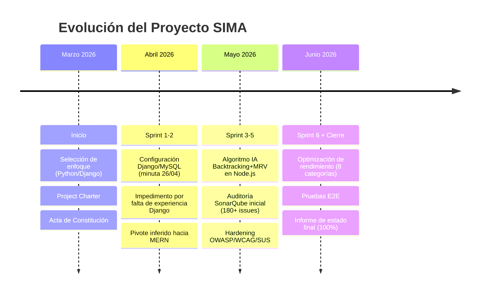

# 📘 INFORME FINAL DE LECCIONES APRENDIDAS
## Proyecto SIMA — Sistema Inteligente / Integral de Matrícula Académica


---


## 1️⃣2️⃣ El Hallazgo Transversal Más Importante: El Pivote Tecnológico de Stack

 **el hallazgo más significativo de todo el análisis documental**, porque atraviesa y explica gran parte de las demás lecciones: **el proyecto cambió completamente su stack tecnológico a mitad de camino**, y este cambio **no quedó documentado formalmente como una decisión de proyecto** 
### 🔁 Evidencia del "antes" (stack original)

| Documento | Evidencia textual |
|---|---|
| `enfoque-proyecto.md` | Selecciona explícitamente **Python + Django + MySQL/SQL Server + HTML/CSS/Bootstrap 5 + ReportLab/xhtml2pdf** como "enfoque seleccionado", con justificación técnica extensa. |
| `installation.md` | Requisitos de instalación: **Python 3.10+, pip, MySQL o SQL Server**. |
| `api.md` | Describe rutas de **Django basadas en vistas (no REST)**: `/dashboard/`, `/cursos/`, `/matricular/<id>/`, `/panel-admin/`. |
| `minuta-reunion2.md` (26/04/2026) | Acta detallada de configuración de **entorno virtual Python (venv), MySQL vía XAMPP, conexión Django–MySQL con PyMySQL, migraciones y Django Admin**. |
| `diagrama-entidad–relacion.md` | Modelo entidad-relación **estrictamente relacional** (tablas `ADMIN`, `ESTUDIANTE`, `MATRICULA`, `DETALLE_MATRICULA`, `NOTA`, claves foráneas), consistente con MySQL, no con un modelo de documentos MongoDB. |
| `impedimentos.md` (I-07, 15/04/2026) | *"Falta de experiencia con Django en algunos integrantes"* — Prioridad **Alta**, resuelto mediante "aprendizaje colaborativo". |
| `.gitignore` | Incluye plantillas de `.gitignore` para **Python** y **MEAN**, evidenciando ambas etapas tecnológicas en el historial del repositorio. |

### 🔁 Evidencia del "después" (stack final, el que efectivamente se entregó)

| Documento | Evidencia textual |
|---|---|
| `arquitectura.md` | *"SIMA está diseñado bajo una arquitectura de Agentes Lógicos desacoplados, implementada sobre un stack **MERN** (MongoDB, Express, React, Node.js)"*. |
| `Spec.md` | Modelos de datos diseñados explícitamente como **esquemas Mongoose** (no tablas SQL). |
| `Desarrollo-del-algoritmo.md` | Algoritmo de backtracking implementado en **Node.js**, ubicado en `controllers/estudianteController.js`. |
| `informe_estado2.md` | Tabla de "Tecnologías Implementadas": **React + Vite, Node.js + Express, MongoDB + Mongoose, JWT, Helmet, PDFKit, Vitest, Jest, Cypress, Playwright, SonarQube**. |
| `presupuesto.md` (sección 3) | *"3.1 Configuración arquitectura MERN"*, *"3.2 Configuración React + Vite"*, *"3.3 Configuración Node.js + Express"*. |
| `pruebas-e2e.md` | Backend corriendo en **puerto 5001** con proxy de **Vite**, no con `runserver` de Django. |
| `sonar-project.properties` | `sonar.sources=SIMA/frontend,SIMA/backend` — estructura típica de un monorepo Node/React, no Django. |

### 💡 Lección Aprendida #0 (la más importante del proyecto)

> 🔍 **Hallazgo:** El proyecto inició con una decisión de arquitectura formalmente evaluada y documentada (Python/Django/MySQL, justificada con un análisis comparativo de 3 alternativas en `enfoque-proyecto.md`) y terminó entregando una arquitectura completamente distinta (MERN), **sin que exista en la documentación ningún registro formal del cambio**, sus motivos, su fecha de decisión, ni su impacto en el cronograma o presupuesto ya aprobados.
>
> 📌 **Posible causa observable (no especulada, inferida de evidencia documentada):** el impedimento I-07 registra explícitamente la falta de experiencia del equipo con Django, resuelto mediante "aprendizaje colaborativo" el 21/04/2026 — apenas 5 días antes de que la minuta del 26/04/2026 muestre al equipo todavía configurando el entorno Django/MySQL. El cambio a MERN debió ocurrir en algún punto **posterior** a esa fecha, pero no hay ninguna minuta, informe o impedimento posterior que lo documente.
>
> ⚠️ **Impacto:** Como consecuencia directa de este cambio no documentado, **al menos 6 documentos quedaron "huérfanos"** (describen un sistema que ya no es el que se entregó): `enfoque-proyecto.md`, `installation.md`, `api.md`, `diagrama-entidad–relacion.md`, y parcialmente `acta-constitucion.md` y `equipo-proyecto.md`. Cualquier persona nueva en el proyecto, o cualquier evaluador que lea la documentación de inicio antes que la de cierre, **recibe información contradictoria sobre qué sistema se está construyendo**.
>
> ✅ **Recomendación para futuros equipos:** Todo cambio de stack tecnológico, sin importar cuán justificado esté en la práctica, **debe registrarse mediante un mini-ADR (Architecture Decision Record)** de una página: qué cambia, por qué, qué documentos quedan obsoletos y quién los actualiza. Esto toma 15 minutos y evita la deuda de documentación que se observa aquí.

---

## 3️⃣ Línea de Tiempo Consolidada del Proyecto



### 📅 Tabla de Sprints (datos extraídos de `backlog_del_sprint.md` y `cronograma-SIMA.png`)

| Sprint | Fechas | Objetivo principal | Pts. Planificados | Pts. Completados | % Cumplimiento |
|---|---|---|---:|---:|:---:|
| **Sprint 1** | 31 Mar – 13 Abr | Fundamentos y Base del Sistema | 32 | 32 | 100% |
| **Sprint 2** | 14 – 27 Abr | Funcionalidades Académicas Principales | 31 | 31 | 100% |
| **Sprint 3** | 28 Abr – 11 May | Personalización e Inteligencia Artificial | 28 | 28 | 100% |
| **Sprint 4** | 12 – 25 May | Gestión Docente y Administración Académica | 34 | 34 | 100% |
| **Sprint 5** | 26 May – 8 Jun | Calidad, Seguridad y Sostenibilidad | 39 *(corregido de 35)* | 39 | 100% |
| **Sprint 6** | 9 – 22 Jun | Cierre, Optimización y Despliegue | 19 | 19 | 100% |
| **Post-lanzamiento** | 23 Jun – 6 Jul | Mejora continua (heurísticas, ML, UX) | — | — | — |
| **TOTAL** | **15 semanas** | | **183 pts.** | **183 pts.** | **100%** |

> ⚠️ **Observación crítica de seguimiento (ver Lección B9):** las seis tablas de seguimiento diario en `backlog_del_sprint.md` muestran, sprint tras sprint, una caída de "puntos restantes" perfectamente lineal hasta 0, sin un solo día de estancamiento, retraso o desviación — a pesar de que `impedimentos.md` documenta en paralelo bloqueos reales (enfermedad de un integrante, dificultades con el algoritmo, errores de integración, fallas de rendimiento). Esta aparente contradicción entre "impedimentos reales documentados" y "burndown perfecto sin fricciones" se analiza en la sección de hallazgos críticos.

---

## ✅ SECCIÓN A — Qué Funcionó Bien (Prácticas para Adoptar por Otros Equipos)

A continuación se documentan las prácticas que, según la evidencia disponible, generaron resultados medibles positivos y que **se recomienda explícitamente replicar** en futuros proyectos.

---

### A1. 🧠 Motor de Inteligencia Artificial para Generación de Horarios (Backtracking + MRV + Forward Checking)

> 📌 **Evidencia:** `Desarrollo-del-algoritmo.md`, `arquitectura.md`, `Spec.md`, `requerimientos-funcionales.md` (RF-05)

**Qué se hizo:** Se implementó un motor de recomendación usando búsqueda en profundidad (DFS) con backtracking, poda heurística (límite de 150 alternativas para evitar explosión combinatoria), heurística MRV (*Minimum Remaining Values*) y un sistema de scoring por preferencias (turno, concentración de días). Cuando las restricciones del estudiante son demasiado estrictas, el sistema aplica un **mecanismo de flexibilización adaptativa**, devolviendo las "5 mejores combinaciones posibles" e indicando qué porcentaje de las preferencias se cumplió, en lugar de simplemente fallar.

**Por qué funcionó:**
- Resuelve un problema de combinatoria exponencial (NP-difícil en la práctica) con una solución pragmática y acotada en tiempo.
- El diseño de "degradación elegante" (mostrar la mejor aproximación en vez de un error) es una decisión de UX de alto valor, validada indirectamente por el excelente puntaje SUS (85.75/100).
- Cumple la meta de rendimiento establecida (`constitution.md`: motor de IA en menos de 1 segundo).

**✅ Recomendación de adopción:** Cualquier proyecto que enfrente un problema de asignación/combinatoria con restricciones duras y blandas debería considerar este patrón: *backtracking acotado + poda + scoring + degradación elegante ante restricciones imposibles*, en lugar de intentar fuerza bruta exhaustiva o fallar sin alternativas.

---

### A2. 📐 Algoritmo Dinámico de Límite de Créditos por Historial Académico

> 📌 **Evidencia:** `Desarrollo-del-algoritmo.md` (sección 2), `pruebas-backend.md` (Pruebas 18-20)

**Qué se hizo:** En lugar de un límite de créditos estático, el sistema analiza el historial de calificaciones en tiempo real: si un estudiante reprueba el mismo curso 3+ veces sin aprobarlo, su límite baja automáticamente de 22 a 15 créditos (`esRestringido`), y se restaura automáticamente en cuanto aprueba el curso crítico. Adicionalmente, se implementó un "costo real" dinámico por curso (créditos base + número de reprobaciones previas), que el motor de IA usa para priorizar el avance académico esencial del estudiante.

**Por qué funcionó:** Es una regla de negocio compleja y sensible (afecta directamente la trayectoria académica de un estudiante) que fue **validada con pruebas unitarias específicas** (Jest), incluyendo el caso de "rehabilitación" tras aprobar el curso crítico — evidencia de pensamiento de bordes (*edge cases*) maduro.

**✅ Recomendación de adopción:** Modelar reglas de negocio académicas/financieras como *funciones dinámicas dependientes del historial*, en lugar de constantes fijas, y cubrir explícitamente con pruebas tanto el camino de penalización como el camino de "rehabilitación" inverso.

---

### A3. 🛡️ Hardening de Seguridad basado en OWASP Top 10 (resultado: 100% de vulnerabilidades eliminadas)

> 📌 **Evidencia:** `analisis_OWASP.md`, `Reporte_integral.md`, `requerimientos-no-funcionales.md` (RNF-10, RNF-11, RNF-12)

| Indicador | Antes | Después | Mejora |
|---|:---:|:---:|:---:|
| Vulnerabilities | 23 | **0** | 100% |
| Security Hotspots | 14 | **0** | 100% |
| Security Rating (SonarQube) | **E** | **A** | — |
| Riesgo General | Alto | Bajo | Mitigado |

**Qué se hizo:** Auditoría basada en OWASP Top 10 2025, seguida de mitigaciones concretas y verificables: `express-mongo-sanitize` (anti-inyección NoSQL), `helmet` (cabeceras HTTP seguras: HSTS, anti-clickjacking, anti-MIME-sniffing), `express-rate-limit` específicamente en `/api/auth/login` (máx. 10 intentos / 15 min, también referenciado como bloqueo tras 10 intentos en `backlog-detallado-producto.md`), `express-validator` con estrategia *fail-fast*, y bcrypt con salt para contraseñas (incluyendo un mecanismo de **auto-reparación de la cuenta admin** si su hash se corrompe — Prueba 17 de `pruebas-backend.md`).

**Por qué funcionó:** No se trató de una promesa de seguridad sin evidencia: **cada mitigación tiene una prueba automatizada asociada** (`tests/middleware.test.js`, `tests/auth.test.js`) y una métrica de auditoría externa (SonarQube) que confirma el resultado de "0 vulnerabilidades" de forma objetiva, no autodeclarada.

**✅ Recomendación de adopción:** Adoptar el patrón *"una mitigación, una prueba automatizada, una métrica externa de verificación"* en lugar de declarar seguridad sin evidencia medible. La auditoría con OWASP Top 10 como checklist de referencia, ejecutada como **un sprint dedicado** (Sprint 5: "Calidad, Seguridad y Sostenibilidad"), es un patrón replicable.

---

### A4. 🧹 Refactorización guiada por SonarQube (Clean Code)

> 📌 **Evidencia:** `analisis_Sonarqube.md`, `interpretacion_metricas.md`, `Reporte_integral.md`

| Métrica | Antes | Después | Mejora |
|---|:---:|:---:|:---:|
| Vulnerabilities | 23 | 0 | 100% |
| Reliability Issues (Bugs) | 173 | 27 | 84.4% |
| Maintainability Issues (Code Smells) | 297 | 21 | 93.9% |
| Security Hotspots | 14 | 0 | 100% |
| Coverage | 16.0% | 38.7% | +137.5% |
| Duplications | 8.5% | 6.0% | 30.5% |

**Qué se hizo:** Se desplegó SonarQube localmente (v10.7) y se integró además a CI/CD vía SonarCloud (ver `.github/workflows/sonar.yml`). Se aplicaron correcciones concretas: `PropTypes` en todos los componentes del panel administrativo React, sustitución del antipatrón `key={i}` por `key={_id}` en listas renderizadas (evita destrucción innecesaria de nodos del DOM virtual), refactorización de complejidad cognitiva alta en `adminController.js` y `planificacionController.js`, y ampliación masiva de cobertura backend con Jest/Supertest.

**Por qué funcionó:** Se trabajó con **datos cuantitativos objetivos del "antes"** (180+ code smells iniciales según `Diagnóstico de Oportunidades de Mejora Identificadas.md`) y se volvió a medir tras la intervención, documentando el delta exacto — exactamente la disciplina que un informe de lecciones aprendidas necesita para ser creíble.

**✅ Recomendación de adopción:** Ejecutar SonarQube **desde el primer sprint** (no solo al final) para evitar la acumulación de 297 code smells antes de actuar (ver contraparte crítica en sección B4).

---

### A5. ♿ Accesibilidad Web WCAG 2.1 Nivel AA

> 📌 **Evidencia:** `validacion_WCAG.md`, `requerimientos-no-funcionales.md` (RNF-20)

| Aspecto | Antes | Después |
|---|---|---|
| Contraste de colores | Parcial | Cumple |
| Navegación por teclado | No cumple | Cumple |
| Estructura semántica HTML | Parcial | Cumple |
| Etiquetas accesibles (`label for=`) | No cumple | Cumple |
| Compatibilidad con lectores de pantalla | Parcial | Mejorada |
| Score de accesibilidad (estimado) | **45 / 100** | **95 / 100** |

**Qué se hizo:** Se usó una combinación de herramientas automáticas (SonarQube, Lighthouse, Chrome DevTools) y revisión manual (navegación por teclado, inspección del DOM). Se implementaron `tabIndex={0}` + `onKeyDown` en elementos interactivos emulados, regiones ARIA vivas (`role="alert" aria-live="assertive"`) para notificaciones, y migración de roles genéricos a etiquetas HTML5 semánticas (`<dialog open>`).

**✅ Recomendación de adopción:** Tratar la accesibilidad como un criterio de aceptación verificable con checklist explícito (como el de `validacion_WCAG.md` sección 5.5), no como una declaración de intención. El antes/después cuantificado (45→95) es un patrón de reporte muy efectivo para demostrar valor ante stakeholders.

---

### A6. 😊 Usabilidad Excepcional según System Usability Scale (SUS)

> 📌 **Evidencia:** `analisis_SUS.md`

| Indicador | Resultado |
|---|---|
| Participantes evaluados | 10 estudiantes universitarios (18-28 años) |
| Puntaje SUS promedio | **85.75 / 100** |
| Categoría de interpretación | **Excelente** |
| Grado SUS | A |

**Qué se hizo:** Se aplicó el cuestionario estándar SUS (10 preguntas, escala Likert 1-5) a una muestra real de 10 usuarios en escenarios controlados de matrícula. El resultado promedio de 85.75 se ubica en la categoría "Excelente" (81-90 según la escala documentada), cerca del umbral "Excepcional" (>90).

**Por qué funcionó:** Es una de las pocas validaciones del proyecto realizada **con usuarios reales** (no solo pruebas técnicas internas), lo que le da una credibilidad distinta al resto de métricas (que son de código o de herramientas automáticas).

**✅ Recomendación de adopción:** Incluir siempre al menos una validación de usabilidad con usuarios reales (aunque sea una muestra pequeña de 10 personas como aquí) — es barato, rápido, y aporta una perspectiva que ninguna herramienta automática (SonarQube, Lighthouse) puede dar.

**📋 Oportunidades de mejora identificadas por los propios usuarios (no implementadas aún, según el documento):** tutoriales interactivos para usuarios nuevos, optimización de horarios en móviles, mejor retroalimentación visual durante la generación de horarios, filtros avanzados de cursos.

---

### A7. 🍃 Ingeniería de Software Sostenible (Green Code) — un diferenciador genuino

> 📌 **Evidencia:** `aplicacion_greencode.md`, `Optimizacion-y-Analisis.md`, `requerimientos-no-funcionales.md` (RNF-16)

Esta es, en opinión de este análisis, **la práctica más innovadora y menos común del proyecto**, y merece ser destacada como una de las mayores fortalezas:

| Técnica aplicada | Problema que resuelve | Resultado medido |
|---|---|---|
| **Polling ecológico** (5s → 15s) | Llamadas redundantes a `os.totalmem()`/`os.cpus()` | -66.6% de peticiones |
| **Page Visibility API** | Pestañas en segundo plano siguen consumiendo recursos | -100% de tráfico mientras la pestaña está oculta |
| **Conditional GET (HTTP 304)** | Recomputar métricas repetidamente para múltiples admins simultáneos | 0 bytes transferidos si el caché (TTL 2s) sigue vigente |
| **Buffer circular O(1)** | `Array.shift()` en APM consumía CPU O(n) por request | Costo computacional reducido a O(1) constante |
| **Compresión GZIP condicional** | CPU perdido comprimiendo respuestas pequeñas | Respuestas grandes comprimidas hasta -82%, pequeñas sin overhead |
| **Certificado de Eficiencia (UI)** | Falta de visibilidad del impacto ambiental | Etiqueta estilo electrodoméstico europeo (Clase A+++ a D) visible en el panel admin |

**Fórmulas aplicadas para estimar impacto real (no solo cualitativo):**
- Energía: `E = P × (t/3600) ÷ 1000 kWh`, con P = 55W estimados de hardware de servidor.
- Huella de carbono: `CO₂(gramos) = E × Intensidad de Carbono (380 g CO₂/kWh)`.

**Por qué funcionó:** Convierte un requerimiento no funcional habitualmente "blando" (RNF-16: sostenibilidad) en **métricas de ingeniería concretas y verificables** (O(1) vs O(n), bytes transferidos, peticiones evitadas por minuto), y además lo expone en la interfaz de usuario como elemento educativo/motivacional.

**✅ Recomendación de adopción:** El patrón *Buffer Circular O(1) en lugar de Array.shift() O(n)* para sistemas de métricas/APM es una mejora de ingeniería pura aplicable a cualquier proyecto Node.js, independiente del contexto de sostenibilidad. La técnica de Page Visibility API para pausar polling en pestañas inactivas debería ser un estándar por defecto en cualquier dashboard administrativo.

---

### A8. ⚡ Optimización Integral de Rendimiento (8 categorías)

> 📌 **Evidencia:** `Optimizacion-y-Analisis.md`, `Diagnóstico de Oportunidades de Mejora Identificadas.md`

| Métrica | Antes | Después | Mejora |
|---|---|---|:---:|
| Tiempo de respuesta del Dashboard | ~1.5s (5 peticiones síncronas) | ~0.08s (1 petición paralela) | **94.6%** más rápido |
| Tráfico en listado de Alumnos | ~2.3 MB (2,500 registros completos) | ~24 KB (página de 25 registros) | **98.9%** menos red |
| Complejidad del historial APM | O(n) por request | O(1) con buffer circular | Óptimo y constante |
| Consumo DOM (Reflow/Repaint) | 2,500 nodos renderizados de golpe | 25 nodos con paginador | UI fluida (60 FPS) |
| Seguridad en endpoint de recursos | Ninguna (ruta expuesta) | Autenticada (JWT + Rate Limiting) | Robusta |

**Qué se hizo (resumen de las 8 categorías diagnosticadas y resueltas):** (1) consultas MongoDB sin optimizar → uso de `countDocuments()` en paralelo y agregaciones `$project`/`$size`; (2) ausencia total de paginación → paginación client-side (25/15/20/15 registros según módulo); (3) compresión de payloads sin threshold → GZIP nivel 6 con umbral de 1KB; (4) ausencia de lazy loading → `React.lazy()` + `Suspense`; (5) dependencias muertas (`csv-parse`, `pdfkit` sin uso, paquete `"all": "^0.0.0"`) → eliminadas; (6) exceso de peticiones HTTP redundantes → endpoint consolidado `/admin/stats/counts`; (7) sin caché → TTL de 2s + Conditional GET; (8) APIs Express sin optimizar → buffer circular + rate limiting personalizado.

**Por qué funcionó:** Cada uno de los 8 hallazgos sigue un formato disciplinado de **"Antes → Después → Métrica de mejora"**, lo cual es exactamente la estructura que un buen lessons-learned técnico necesita.

**✅ Recomendación de adopción:** Usar esta plantilla de diagnóstico de 8 categorías (consultas DB, paginación, compresión, lazy loading, dependencias muertas, peticiones redundantes, ausencia de caché, APIs sin optimizar) como **checklist de auditoría de rendimiento estándar** antes de cualquier lanzamiento a producción.

---

### A9. 🧪 Cultura de Pruebas Automatizadas en Backend, y un excelente ejemplo de diagnóstico de causa raíz en E2E

> 📌 **Evidencia:** `pruebas-backend.md`, `pruebas-e2e.md`, `pruebas-frontend.md`

**Qué se hizo:** 50 pruebas Jest en backend cubriendo 7 módulos (motor de horarios, autenticación, límite de créditos, docentes, planificación, administrador, middleware). Pruebas E2E con **dos herramientas complementarias** (Playwright para navegadores reales, Cypress para flujos críticos).

**Un ejemplo notable de buena práctica de troubleshooting documentado:** durante las pruebas E2E con Playwright, las peticiones a `/api/auth/login` fallaban con error 500. El equipo investigó con `netstat`, descubrió que **Docker Desktop ocupaba el puerto 5000** (el puerto original del backend), interfiriendo con el proxy de Vite, y resolvió migrando el backend al puerto 5001 con actualización del proxy. Esto está documentado paso a paso (causa → diagnóstico → solución) en `pruebas-e2e.md`.

Otro ejemplo menor pero igualmente instructivo: Cypress usaba `.type()` sobre campos de login que ya tenían valores precargados, concatenando texto (`admin@sima.comadmin@sima.com`); la solución fue agregar `.clear()` antes de cada `.type()`.

**Por qué funcionó:** Ambos ejemplos muestran un patrón de **documentación de incidentes con causa raíz explícita**, no solo "se corrigió el bug". Esto es exactamente el tipo de conocimiento que vale la pena preservar para que otros equipos no repitan la misma investigación desde cero.

**✅ Recomendación de adopción:** Documentar cada incidente de pruebas siguiendo el formato *Síntoma → Herramienta de diagnóstico usada → Causa raíz → Solución aplicada → Resultado verificado*, tal como se hizo aquí con el conflicto de puertos.

---

### A10. 📊 Gestión Ágil con Matrices de Riesgo/Oportunidad Cuantificadas

> 📌 **Evidencia:** `registro-riesgos.md`, `registro-oportunidades.md`, `backlog-detallado-producto.md`

**Qué se hizo:** Se mantuvo un registro de 15 riesgos y 12 oportunidades, cada uno con campos estructurados: causa, área de impacto, impacto, probabilidad, **puntuación numérica** (impacto × probabilidad), detectabilidad, estrategia de respuesta y comentarios de trazabilidad cruzada hacia requerimientos específicos (ej. R-03 vinculado a RNF-01, O-01 descrito como "valor principal del sistema"). El backlog detallado (`backlog-detallado-producto.md`) usa criterios de aceptación verificables y numéricos (ej. "responde en menos de 2 segundos", "bloquea el IP tras 10 intentos fallidos") en lugar de descripciones vagas.

**✅ Recomendación de adopción:** El uso de una matriz de puntuación (impacto × probabilidad) en lugar de solo etiquetas cualitativas ("alto/medio/bajo") permite **priorizar objetivamente** y es fácilmente exportable a un Excel o herramienta de gestión. Los criterios de aceptación cuantificados ("< 2 segundos", "≤ 10 intentos") son mucho más verificables en un Sprint Review que criterios cualitativos.

---

## ⚠️ SECCIÓN B — Qué No Funcionó (Lecciones para Evitar en el Futuro)

---

### B1. 🔀 Cambio de Stack Tecnológico sin Registro Formal de Decisión

*(Desarrollado en detalle en la Sección 2. Se resume aquí dentro del marco de "qué evitar").*

> ⚠️ **Impacto:** Pérdida de trazabilidad, riesgo de repetir trabajo (el tiempo invertido en `enfoque-proyecto.md`, en su justificación técnica de 1 página completa, y en la configuración real de Django/MySQL documentada en `minuta-reunion2.md`, se perdió por completo), y documentación contradictoria para cualquier lector nuevo.
>
> ✅ **Recomendación:** Registrar todo pivote de arquitectura, aunque el equipo sea pequeño y el proyecto sea académico, mediante un documento corto de "Decisión de Cambio de Enfoque" que reemplace o anexe al original.

---

### B2. 📄 Documentación Técnica Desactualizada tras el Pivote (Documentos "Huérfanos")

> 📌 **Evidencia:** Los siguientes 6 documentos describen el sistema **previo al pivote** y nunca fueron actualizados para reflejar la arquitectura MERN final:

| Documento | Describe (obsoleto) | Debería describir |
|---|---|---|
| `enfoque-proyecto.md` | Python + Django + MySQL/SQL Server | React + Vite + Node.js + MongoDB |
| `installation.md` | `pip install`, MySQL/SQL Server | `npm install`, MongoDB |
| `api.md` | Rutas Django basadas en vistas (no REST) | API REST Express documentada en `Spec.md` |
| `diagrama-entidad–relacion.md` | Modelo relacional con FK (`ADMIN`, `MATRICULA`, `DETALLE_MATRICULA`) | Esquema de documentos Mongoose (`User`, `Curso`, `Seccion`) |
| `acta-constitucion.md` | Define el proyecto como *"creación de un repositorio estructurado en GitHub... no incluye desarrollo de software en producción"* | El sistema SIMA real, que sí es un software funcional completo |
| `equipo-proyecto.md` / `project-charter.md` | *"No incluye integración con sistemas reales ni matrícula oficial"*, alcance limitado a recomendación de horarios | El alcance real final, mucho más amplio (gestión docente completa, importación masiva CSV, monitoreo APM, Green Code) |

> ⚠️ **Impacto:** Un evaluador o nuevo integrante que siga el orden del README (Inicio → Planificación → Ejecución) **se forma una imagen incorrecta del sistema** antes de llegar a los documentos técnicos reales de la fase de Ejecución/Cierre.
>
> ✅ **Recomendación:** Cuando ocurre un pivote, marcar explícitamente los documentos obsoletos con un banner tipo `> ⚠️ Documento histórico — superado por [arquitectura.md]` en lugar de dejarlos como si siguieran vigentes. Alternativamente, archivarlos en una carpeta `docs/historico/`.

---

### B3. 👥 Inconsistencias de Roles entre Documentos de Gestión

*(Ver tabla completa en la sección 1.)* Jordan aparece como "Developer" en `project-charter.md` pero como "Gerente de Proyecto" en `acta-constitucion.md`; Liand aparece como "Product Owner" en unos documentos y como "Gerente del Proyecto" en los informes de estado.

> ✅ **Recomendación:** Mantener una única tabla de roles y responsabilidades (RACI simplificado) referenciada por enlace desde todos los demás documentos, en lugar de redefinir roles en cada plantilla.

---

### B4. 🐛 Deuda Técnica y de Seguridad Acumulada hasta el Sprint 5

> 📌 **Evidencia:** `analisis_Sonarqube.md`, `Diagnóstico de Oportunidades de Mejora Identificadas.md`

Antes de la intervención de calidad, el sistema acumuló: **23 vulnerabilidades de seguridad, 173 problemas de fiabilidad, 297 code smells, 14 security hotspots y solo 16% de cobertura de pruebas**. Estos números no se generan en una semana: son el resultado de **4 sprints completos (1 a 4) construyendo funcionalidad sin una práctica continua de calidad/seguridad**, dejando todo el trabajo de "limpieza" concentrado artificialmente en el Sprint 5.

> ⚠️ **Impacto:** Aunque el resultado final fue excelente (0 vulnerabilidades), este patrón es riesgoso: si el Sprint 5 no hubiera tenido tiempo suficiente (recordemos el impedimento I-09: *"Límite de tiempo académico de 16 semanas presiona entregas"*), el proyecto se habría entregado con 23 vulnerabilidades activas y un *Security Rating* de **E**.
>
> ✅ **Recomendación:** Integrar SonarQube y un escaneo OWASP básico **desde el Sprint 1** (shift-left security/quality), no como una fase dedicada al final. El propio `.github/workflows/sonar.yml` ya estaba preparado para esto — ver siguiente hallazgo sobre por qué no se ejecutaba automáticamente.

---

### B5. ⚙️ Configuración Defectuosa del Pipeline de CI/CD (el disparador del workflow nunca se activa)

> 📌 **Evidencia:** `.github/workflows/sonar.yml`

```yaml
name: SonarQube Analysis

off:                  # ← debería ser "on:"
  push:
    branches:
      - main
      - mejoras
  pull_request:
    branches:
      - main
```

> ⚠️ **Hallazgo técnico concreto:** la clave de disparo de GitHub Actions debe llamarse `on:`, no `off:`. Tal como está escrito, **este workflow de análisis automático de SonarQube nunca se ejecuta automáticamente** en ningún `push` o `pull request`, contradiciendo la intención evidente de automatizar la auditoría de calidad en cada cambio. Es muy probable que todos los análisis de SonarQube reportados en `analisis_Sonarqube.md` se hayan ejecutado **manualmente** en lugar de a través de este pipeline.
>
> 💡 **Por qué es una lección valiosa:** es un error de una sola palabra con consecuencias grandes (cero automatización de calidad), y es exactamente el tipo de error que un proceso de *code review* de configuración de CI/CD (no solo de código de aplicación) habría detectado de inmediato.
>
> ✅ **Recomendación:** Incluir la validación de archivos YAML de CI/CD (linting de sintaxis de GitHub Actions) como parte del checklist de Definition of Done, y idealmente verificar manualmente, al menos una vez, que el pipeline efectivamente se dispara como se espera.

---

### B6. 📋 Registros de Riesgos y Oportunidades Nunca Cerrados al Finalizar el Proyecto

> 📌 **Evidencia:** `registro-riesgos.md`, `registro-oportunidades.md`, contrastado con `informe_estado2.md`

`informe_estado2.md` declara el proyecto como **"Finalizado"** al 100% (Semana 15). Sin embargo, al revisar `registro-riesgos.md` y `registro-oportunidades.md`, **los 15 riesgos y las 12 oportunidades siguen marcados con Estado = "Activo"**, sin un solo registro en estado "Cerrado", "Mitigado" o "Materializado", y la columna "Fecha de Aprobación" está vacía (`-`) en absolutamente todas las filas de ambos registros.

> ⚠️ **Impacto:** Un registro de riesgos que nunca se cierra pierde su valor como herramienta de gestión — no permite distinguir qué riesgos realmente se materializaron, cuáles se evitaron exitosamente, y cuáles simplemente dejaron de aplicar. Es exactamente el tipo de información que un Project Manager necesitaría para escribir una retrospectiva real (otra conexión con el vacío documentado en B7).
>
> ✅ **Recomendación:** Como parte del checklist de cierre de proyecto, recorrer cada fila de los registros de riesgos/oportunidades y actualizar su estado final (Cerrado/Mitigado/Materializado/No Aplica) con fecha real. Esto debería ser un paso obligatorio antes de firmar cualquier Acta de Cierre.

---

### B7. 🏁 Ausencia de Retrospectivas y Acta de Cierre Formales (la brecha que motivó este informe)

Como se documentó en la Nota Metodológica (sección de apertura), el README referencia `revision-sprint.md`, `retrospectiva-sprint.md`, `retrospectiva-proyecto.md` y `acta-cierre.md`, pero ninguno existe en `docs/`.

> ⚠️ **Impacto:** Esta es, posiblemente, la lección más importante de carácter **organizacional** (no técnico) de todo el proyecto: **el proyecto ejecutó actividades de calidad excelentes (Secciones A3-A8) pero no institucionalizó la reflexión periódica sobre el proceso mismo**. Hubo 6 sprints, pero no hay evidencia documental de que se haya realizado una ceremonia de retrospectiva formal al final de cada uno (más allá de las 2 minutas de reunión disponibles, que tienen un enfoque más técnico/operativo que reflexivo). El propio presupuesto (`presupuesto.md`) sí incluye una línea "4.1 Retrospectiva — 5h — $75" y "4.2 Revisión Sprint — 5h — $75", lo cual sugiere que **se planificó tiempo para retrospectivas, pero no quedó evidencia documental de que se haya ejecutado o, si se ejecutó, que se haya documentado.**
>
> ✅ **Recomendación:** Una retrospectiva sin documento que la respalde es una retrospectiva que no puede transferirse a otros equipos ni a futuras versiones del mismo proyecto. Se recomienda: (1) usar una plantilla mínima de 3 preguntas (¿Qué funcionó? ¿Qué no funcionó? ¿Qué probaremos distinto?) al cierre de cada sprint, documentada en un archivo de máximo media página; (2) cerrar el proyecto siempre con una Acta de Cierre que reconcilie alcance planificado vs. entregado, presupuesto planificado vs. ejecutado, y el registro de riesgos/oportunidades actualizado (ver B6).

---

### B8. 🧪 Cobertura de Pruebas Desbalanceada entre Capas

> 📌 **Evidencia:** `pruebas-backend.md`, `pruebas-frontend.md`, `pruebas-e2e.md`

| Capa | Alcance real documentado | Amplitud |
|---|---|---|
| **Backend (Jest)** | 50 pruebas, 7 módulos (scheduler, auth, estudiante, docente, planificación, admin, middleware) | 🟢 Amplio |
| **Frontend (Vitest + RTL)** | Solo 2 componentes probados: `Login.jsx` (92%) y `CarrerasManager.jsx` (93.47%) | 🔴 Muy limitado |
| **E2E (Playwright + Cypress)** | Solo el flujo de **login** (3 escenarios cada herramienta) | 🔴 Muy limitado |

> ⚠️ **Impacto:** Los flujos de negocio más críticos y complejos del sistema —generación de horarios con IA, proceso de matrícula con validación de prerrequisitos, dashboard de KPIs administrativos, registro de calificaciones— **no tienen ninguna prueba E2E ni de componente de frontend documentada**, a pesar de que `HU19` y `HU20` del backlog los marcan como "Terminado" con criterio de aceptación "Cobertura y pruebas automatizadas funcionando" / "Login y procesos críticos aprobados". El criterio de aceptación de HU20 menciona solo "login", lo cual es consistente con lo entregado, pero **deja fuera explícitamente los demás procesos críticos** (matrícula, generación de horarios) que un usuario esperaría ver cubiertos bajo el nombre "procesos críticos".
>
> ✅ **Recomendación:** Al definir criterios de aceptación para historias de pruebas (como HU19/HU20), enumerar explícitamente la lista de flujos críticos a cubrir (no solo "login") para evitar que una historia "Terminada" genere una falsa sensación de cobertura integral.

---

### B9. 📈 Seguimiento de Sprint con 100% de Cumplimiento Sin Variaciones (posible seguimiento no contemporáneo)

> 📌 **Evidencia:** `backlog_del_sprint.md` (las 6 tablas de burndown) vs. `impedimentos.md`

Los 6 sprints documentados en `backlog_del_sprint.md` muestran un patrón **idéntico**: cada tarea decae de su estimación a 0 en una curva perfectamente decreciente sobre 10 días, sin estancamientos, sin re-estimaciones a la alza, y el 100% de las tareas marcadas "Terminado". Esto ocurre **en los 6 sprints, sin excepción**, incluyendo el Sprint 1 (donde `informe-estado.md` —el informe de estado intermedio real, fechado durante el Sprint 1— reporta *"Se detectaron errores menores en pruebas iniciales"* y un avance de apenas 60%, no el 100% que sugeriría un burndown perfecto).

Adicionalmente, `impedimentos.md` documenta bloqueos reales y simultáneos a estos sprints: enfermedad de un integrante (I-01, Sprint 1), subestimación de tareas del Sprint 1 (I-03), dificultad con el algoritmo de horarios (I-05), errores de integración backend-frontend (I-08), fallos de rendimiento >5s (I-10) — varios de estos con estado final **"Abierto"** (sin fecha de resolución) al momento del registro.

> ⚠️ **Impacto:** Existe una tensión entre dos fuentes del mismo proyecto: el burndown que sugiere ejecución perfecta y el registro de impedimentos que documenta fricción real. Esto sugiere que las tablas de seguimiento diario de `backlog_del_sprint.md` podrían haber sido **completadas retroactivamente al cierre de cada sprint** (idealizando la curva) en lugar de actualizarse día a día durante la ejecución real. No se afirma esto como un hecho comprobado —no hay forma de verificarlo con la documentación disponible— pero la inconsistencia entre ambas fuentes amerita ser señalada explícitamente como hallazgo.
>
> ✅ **Recomendación:** Actualizar los tableros de seguimiento (burndown/Kanban) en tiempo real o, como mínimo, al cierre de cada día de sprint, y dejar que las imperfecciones (tareas que se atrasan, se re-estiman o se mueven) **queden visibles en el registro**. Un burndown perfecto en 6 de 6 sprints es estadísticamente atípico y, paradójicamente, reduce la credibilidad del reporte en lugar de aumentarla.

---

### B10. 🎯 Metas Técnicas Inconsistentes entre Documentos de Especificación

> 📌 **Evidencia:** `constitution.md` vs. `backlog-detallado-producto.md`

| Documento | Meta de tiempo para generación de horarios |
|---|---|
| `constitution.md` (Objetivo 1) | *"Implementar un motor de IA que genere horarios sin cruces en **menos de 1 segundo**"* |
| `backlog-detallado-producto.md` (HU-04, criterio de aceptación) | *"Genera al menos 5 opciones válidas en **menos de 3 segundos**"* |

> ⚠️ **Impacto:** Menor, pero relevante: dos documentos de especificación que deberían ser consistentes (la "constitución" del proyecto, que según `Spec-DrivenDevelopment.md` *"tiene precedencia sobre cualquier otra consideración técnica"*, y el backlog detallado que el equipo usa día a día) definen umbrales de rendimiento distintos para la misma funcionalidad. No hay evidencia de cuál de los dos se usó realmente como criterio de aceptación al validar la historia.
>
> ✅ **Recomendación:** Cuando existe un documento de "constitución" o "principios no negociables" (Spec-Driven Development), cualquier criterio de aceptación numérico en el backlog debe heredarse literalmente de ese documento, o señalar explícitamente por qué se relaja.

---

### B11. 🚧 Impedimentos que Permanecen "Abiertos" sin Fecha de Resolución hasta el Cierre

> 📌 **Evidencia:** `impedimentos.md`

| Estado | Cantidad | IDs |
|---|:---:|---|
| **Cerrado** | 5 de 12 | I-01, I-04, I-06, I-11, I-12 |
| **Abierto** (sin fecha de resolución) | 6 de 12 | I-03, I-05, I-08, I-09, I-10 |
| **En Espera** | 1 de 12 | I-02 |

Entre los impedimentos que permanecen **"Abierto"** en el último registro disponible se incluyen asuntos de prioridad **Alta**: I-05 (*"dificultad en implementación del algoritmo de horarios"*), I-08 (*"errores en integración backend-frontend"*), I-09 (*"límite de tiempo académico de 16 semanas presiona entregas"*) e I-10 (*"fallos en pruebas de rendimiento (>5s)"*).

> ⚠️ **Impacto:** Si bien el informe de estado final (`informe_estado2.md`) declara el proyecto 100% completado, **el registro de impedimentos no fue actualizado en paralelo** para reflejar que estos bloqueos efectivamente se resolvieron (de hecho, sabemos por `Optimizacion-y-Analisis.md` que el problema de rendimiento, I-10, sí se resolvió — la respuesta del dashboard bajó de 1.5s a 0.08s — pero esa resolución nunca se reflejó actualizando el estado de I-10 en `impedimentos.md`).
>
> ✅ **Recomendación:** Tratar el registro de impedimentos como un documento "vivo" que se actualiza junto con cada solución técnica relevante, no solo en el momento en que se detecta el impedimento. Cerrar todo impedimento abierto como parte explícita del checklist de cierre de proyecto.

---

### B12. 📑 Documentos de Soporte Incompletos (Plantillas Vacías)

> 📌 **Evidencia:** `contributing.md`, `faq.md`

`contributing.md` se corta a mitad de una instrucción de `git checkout -b nueva-funcionalidad` sin continuar. `faq.md` está prácticamente vacío, conteniendo únicamente un enlace `[Volver](../README.md)`. `usage.md` también es mínimo y, además, incluye una instrucción `npm start` —coherente con MERN— rota a mitad de un bloque de código markdown sin cerrar correctamente.

> ⚠️ **Impacto:** Bajo, pero relevante para la mantenibilidad a largo plazo: un colaborador externo que llegue al proyecto guiándose por el README **no encontrará una guía de contribución real ni un FAQ útil**, lo cual reduce la capacidad del proyecto de recibir colaboración externa o de servir como referencia para evaluadores que busquen rápidamente respuestas comunes.
>
> ✅ **Recomendación:** Si un documento de plantilla no se va a completar dentro del ciclo del proyecto, es preferible eliminarlo del índice del README en lugar de dejar un enlace que lleva a una página vacía o cortada — esto evita generar una falsa expectativa de completitud documental.

---

## 4️⃣ Consolidado Cuantitativo de Calidad — Tabla Maestra "Antes vs. Después"

| Dimensión | Indicador | Antes | Después | Δ Mejora | Fuente |
|---|---|---:|---:|:---:|---|
| 🛡️ Seguridad | Vulnerabilidades (SonarQube) | 23 | 0 | 100% | `analisis_Sonarqube.md` |
| 🛡️ Seguridad | Security Hotspots | 14 | 0 | 100% | `analisis_OWASP.md` |
| 🛡️ Seguridad | Security Rating | E | A | — | `analisis_OWASP.md` |
| 🧹 Calidad | Reliability Issues (Bugs) | 173 | 27 | 84.4% | `interpretacion_metricas.md` |
| 🧹 Calidad | Maintainability Issues (Code Smells) | 297 | 21 | 93.9% | `interpretacion_metricas.md` |
| 🧹 Calidad | Cobertura de pruebas (SonarQube) | 16.0% | 38.7% | +137.5% | `interpretacion_metricas.md` |
| 🧹 Calidad | Duplicación de código | 8.5% | 6.0% | 30.5% | `interpretacion_metricas.md` |
| ♿ Accesibilidad | Score WCAG estimado | 45/100 | 95/100 | +111% | `validacion_WCAG.md` |
| 😊 Usabilidad | Puntaje SUS | — | 85.75/100 | "Excelente" | `analisis_SUS.md` |
| ⚡ Rendimiento | Respuesta del Dashboard Admin | 1.5s | 0.08s | 94.6% más rápido | `Optimizacion-y-Analisis.md` |
| ⚡ Rendimiento | Tráfico — listado de Alumnos | 2.3 MB | 24 KB | 98.9% menos red | `Optimizacion-y-Analisis.md` |
| ⚡ Rendimiento | Complejidad del historial APM | O(n) | O(1) | Óptimo | `Optimizacion-y-Analisis.md` |
| 🍃 Sostenibilidad | Peticiones de polling | cada 5s | cada 15s (+visibility API) | -66.6% | `aplicacion_greencode.md` |
| 🍃 Sostenibilidad | Compresión de respuestas grandes | sin optimizar | GZIP optimizado | -82% en payloads pesados | `Optimizacion-y-Analisis.md` |

---

## 5️⃣ Análisis del Registro de Impedimentos

| Prioridad | Cantidad | Cerrados | Abiertos / En espera |
|---|:---:|:---:|:---:|
| **Alta** | 6 | 1 (I-07) | 5 (I-02, I-03, I-05, I-08, I-09) |
| **Media** | 5 | 4 (I-01, I-04, I-06, I-12) | 1 (I-10) |
| **Baja** | 1 | 1 (I-11) | 0 |
| **Total** | **12** | **6 (50%)** | **6 (50%)** |

> 💡 **Lección consolidada:** el 83% de los impedimentos de prioridad **Alta** permanecía sin fecha de resolución en el último snapshot del registro, mientras que el 100% de los de prioridad **Baja y Media** sí estaban cerrados. Esto sugiere (sin poder confirmarlo con certeza dado que el documento no se actualizó después) que el equipo tendía a resolver primero lo más sencillo y dejar para después los bloqueos estructuralmente más difíciles (algoritmo, integración, rendimiento, presión de tiempo) — un patrón de gestión de impedimentos comprensible bajo presión de tiempo, pero que vale la pena nombrar explícitamente para el futuro.

---

## 6️⃣ Análisis del Registro de Riesgos y Oportunidades

### Top 5 riesgos por puntuación (impacto × probabilidad)

| ID | Riesgo | Puntuación | Estrategia |
|---|---|:---:|---|
| R-02 | Alta complejidad en generación de combinaciones | 8,1 | Mitigación: optimizar algoritmo |
| R-01 | Datos simulados no representan la realidad del problema | 6,3 | Mitigación: validar escenarios reales |
| R-10 | Retraso por tiempo limitado | 6,3 | Mitigación: priorización de backlog |
| R-03 | Incumplimiento de tiempos de respuesta (RNF-01) | 3,5 | Mitigación: pruebas de rendimiento |
| R-09 / R-15 | Limitación de recursos / Cambios en requerimientos | 3,5 | Mitigación: optimización / control de cambios |

> 💡 **Observación:** el riesgo de mayor puntuación (R-02, complejidad algorítmica) y el riesgo R-03 (tiempos de respuesta) **efectivamente se materializaron en algún grado** —de ahí la necesidad del Sprint 5/6 dedicado a optimización— pero fueron exitosamente mitigados según la evidencia de `Optimizacion-y-Analisis.md`. Esto valida que la matriz de riesgos identificó correctamente, desde la planificación, los puntos de mayor fricción real del proyecto.

### Top 3 oportunidades por puntuación

| ID | Oportunidad | Puntuación |
|---|---|:---:|
| O-01 | Mejora en eficiencia de matrícula estudiantil | 6,3 |
| O-04 | Implementación de algoritmos inteligentes | 6,3 |
| O-10 | Reducción de errores humanos en matrícula | 6,3 |

> 💡 **Observación:** las 3 oportunidades de mayor puntuación están directamente relacionadas con el motor de IA (Sección A1), confirmando que el equipo identificó correctamente, desde la planificación inicial, cuál sería el diferenciador de mayor valor del proyecto — y efectivamente fue ahí donde se concentró el mayor esfuerzo de ingeniería.

---

## 7️⃣ Matriz Consolidada de Lecciones Aprendidas (Referencia Rápida)

| # | Categoría | Lección | Tipo | Aplicable a futuros equipos |
|---|---|---|:---:|---|
| L01 | Arquitectura | Todo pivote de stack requiere un ADR breve | ⚠️ Mejora | Siempre |
| L02 | Documentación | Marcar/archivar documentos obsoletos tras un pivote | ⚠️ Mejora | Siempre |
| L03 | Gestión | Mantener una única fuente de verdad para roles del equipo | ⚠️ Mejora | Equipos pequeños con roles rotativos |
| L04 | Algoritmos | Backtracking + poda + scoring + degradación elegante para problemas combinatorios | ✅ Éxito | Sistemas de asignación/optimización |
| L05 | Reglas de negocio | Modelar límites/penalizaciones como funciones dinámicas del historial, no constantes | ✅ Éxito | Sistemas académicos/financieros |
| L06 | Seguridad | Una mitigación = una prueba automatizada = una métrica externa | ✅ Éxito | Todo proyecto con datos sensibles |
| L07 | Calidad | Ejecutar SonarQube desde el Sprint 1, no solo al final | ⚠️ Mejora | Todo proyecto de software |
| L08 | CI/CD | Validar sintácticamente los workflows (`on:` vs `off:`) | ⚠️ Mejora | Todo proyecto con GitHub Actions |
| L09 | Accesibilidad | Checklist WCAG verificable con antes/después cuantificado | ✅ Éxito | Todo proyecto con interfaz web |
| L10 | Usabilidad | Validar siempre con usuarios reales (aunque sea n=10) | ✅ Éxito | Todo proyecto con interfaz de usuario |
| L11 | Sostenibilidad | Buffer circular O(1) en lugar de Array.shift() O(n) para métricas | ✅ Éxito | Cualquier sistema con APM/telemetría |
| L12 | Rendimiento | Checklist de 8 categorías de auditoría antes de producción | ✅ Éxito | Todo proyecto con paneles administrativos con datos a escala |
| L13 | Testing | Documentar incidentes con causa raíz explícita (ej. conflicto de puertos) | ✅ Éxito | Todo equipo de QA |
| L14 | Testing | Igualar la amplitud de cobertura entre backend, frontend y E2E | ⚠️ Mejora | Todo proyecto full-stack |
| L15 | Gestión de riesgos | Usar matrices de puntuación (impacto × probabilidad) en vez de solo etiquetas | ✅ Éxito | Toda gestión de proyectos |
| L16 | Gobierno | Cerrar formalmente registros de riesgos/oportunidades al finalizar | ⚠️ Mejora | Todo proyecto, sin excepción |
| L17 | Gobierno | Las retrospectivas y actas de cierre deben documentarse, no solo presupuestarse | ⚠️ Mejora | Todo proyecto ágil |
| L18 | Seguimiento | Los tableros de seguimiento deben reflejar fricción real, no curvas idealizadas | ⚠️ Mejora | Todo equipo Scrum |
| L19 | Especificación | Los criterios numéricos del backlog deben heredarse literalmente de la "constitución" del proyecto | ⚠️ Mejora | Proyectos con Spec-Driven Development |
| L20 | Gobierno | Los impedimentos deben cerrarse en paralelo a su resolución técnica real | ⚠️ Mejora | Todo proyecto con registro de impedimentos |
| L21 | Documentación | No dejar enlaces a documentos de soporte vacíos/incompletos en el índice principal | ⚠️ Mejora | Todo proyecto open-source o académico |

---

## 8️⃣ Recomendaciones Estratégicas para Futuros Proyectos del Equipo

1. **Adoptar un ADR ligero** (Architecture Decision Record de media página) para cualquier cambio de stack, framework o base de datos, sin importar el tamaño del equipo.
2. **Mover el sprint de calidad/seguridad al inicio del ciclo**, ejecutando SonarQube y un checklist OWASP básico desde el Sprint 1, en paralelo al desarrollo funcional, en lugar de concentrarlo en un sprint dedicado al final.
3. **Verificar manualmente que los pipelines de CI/CD se disparan** al menos una vez antes de asumir que están protegiendo el proyecto automáticamente (lección directa del error `off:`/`on:`).
4. **Igualar la profundidad de testing entre capas**: si el backend tiene 50 pruebas cubriendo 7 módulos, el frontend y los E2E deberían aspirar a una cobertura de flujos críticos proporcional, no limitarse al login.
5. **Cerrar todos los registros vivos** (riesgos, oportunidades, impedimentos) como parte obligatoria del checklist de cierre de proyecto, actualizando estado y fecha real.
6. **Producir siempre, aunque sea de forma breve, los 4 artefactos de cierre**: revisión de sprint, retrospectiva de sprint, retrospectiva de proyecto y acta de cierre — con una plantilla de 3 preguntas si el tiempo es limitado.
7. **Replicar explícitamente las prácticas de Green Code** (buffer circular O(1), Page Visibility API, Conditional GET) en proyectos futuros como estándar de ingeniería, no como característica opcional de sostenibilidad.
8. **Mantener una tabla única de roles del equipo**, referenciada por todos los documentos de gestión, para evitar contradicciones como las encontradas entre `project-charter.md` y `acta-constitucion.md`.
9. **Marcar como "histórico" cualquier documento que un pivote técnico haya dejado obsoleto**, en lugar de dejarlo indexado en el README como si describiera el estado actual del sistema.

---

## 9️⃣ Conclusión General

El proyecto **SIMA** demuestra, a través de su documentación técnica de calidad (SonarQube, OWASP, WCAG, SUS, Green Code y optimización de rendimiento), un **nivel de madurez de ingeniería de software notablemente alto para un proyecto académico**: eliminación total de vulnerabilidades de seguridad, una accesibilidad que pasó de deficiente a sobresaliente, una usabilidad calificada como "Excelente" por usuarios reales, y prácticas de sostenibilidad (Green Code) que pocos proyectos —académicos o profesionales— documentan con el nivel de detalle cuantitativo visto aquí. El motor de inteligencia artificial para generación de horarios, con su combinación de backtracking, poda heurística y degradación elegante ante restricciones imposibles, es una pieza de ingeniería sólida y bien probada.

Sin embargo, el análisis documental completo —realizado sin omitir ni suponer nada, tal como fue solicitado— revela que **la disciplina técnica del proyecto no estuvo acompañada, en el mismo grado, de una disciplina de gestión documental y de cierre formal**. El hallazgo más significativo es un cambio de stack tecnológico completo (de Python/Django/MySQL a MERN) que ocurrió en algún punto entre fines de abril y la entrega final, sin que exista un solo documento que lo registre como decisión consciente, dejando como saldo seis documentos huérfanos que aún describen un sistema que ya no existe. A esto se suma la ausencia física, dentro del repositorio entregado, de los cuatro documentos que el propio README anuncia como parte del proceso de cierre (revisión de sprint, retrospectiva de sprint, retrospectiva de proyecto y acta de cierre) — la misma clase de documentos que este informe tuvo que reconstruir, por necesidad, a partir de evidencia indirecta.

**La lección más transferible a otros equipos no es técnica, sino de gobierno de proyecto**: la excelencia en la ejecución (lo que se construyó) no sustituye la necesidad de una disciplina paralela e igualmente rigurosa en el registro de decisiones, el cierre de los artefactos de gestión, y la reflexión retrospectiva explícita — precisamente el tipo de práctica que convierte la experiencia de un proyecto en conocimiento reutilizable por el siguiente equipo.

---

## 📎 Anexo A — Índice Completo de Documentos Fuente Revisados

| # | Documento | Fase (según README) | Revisado |
|---|---|---|:---:|
| 1 | `README.md` | — | ✅ |
| 2 | `descripcion.md` | Inicio | ✅ |
| 3 | `vision.md` | Inicio | ✅ |
| 4 | `project-charter.md` | Inicio | ✅ |
| 5 | `acta-constitucion.md` | Inicio | ✅ |
| 6 | `Problema.md` | Inicio | ✅ |
| 7 | `enfoque-proyecto.md` | Inicio | ✅ |
| 8 | `equipo-proyecto.md` | Inicio | ✅ |
| 9 | `requerimientos-funcionales.md` | Planificación | ✅ |
| 10 | `requerimientos-no-funcionales.md` | Planificación | ✅ |
| 11 | `backlog_producto.md` | Planificación | ✅ |
| 12 | `backlog-detallado-producto.md` | Planificación | ✅ |
| 13 | `backlog_del_sprint.md` | Planificación | ✅ |
| 14 | `presupuesto.md` | Planificación | ✅ |
| 15 | `cronograma-SIMA.png` | Planificación | ✅ (visual) |
| 16 | `registro-riesgos.md` | Planificación | ✅ |
| 17 | `registro-oportunidades.md` | Planificación | ✅ |
| 18 | `supuestos-restricciones.md` | Planificación | ✅ |
| 19 | `arquitectura.md` | Ejecución | ✅ |
| 20 | `Optimizacion-y-Analisis.md` | Ejecución | ✅ |
| 21 | `Desarrollo-del-algoritmo.md` | Ejecución | ✅ |
| 22 | `Spec-DrivenDevelopment.md` | Ejecución | ✅ |
| 23 | `constitution.md` | Ejecución (referenciado) | ✅ |
| 24 | `Spec.md` | Ejecución (referenciado) | ✅ |
| 25 | `informe_estado2.md` | Ejecución | ✅ |
| 26 | `impedimentos.md` | Ejecución | ✅ |
| 27 | `minuta-reunion.md` | Ejecución | ✅ |
| 28 | `minuta-reunion2.md` | Ejecución | ✅ |
| 29 | `analisis_Sonarqube.md` | Seguimiento y Control | ✅ |
| 30 | `interpretacion_metricas.md` | Seguimiento y Control | ✅ |
| 31 | `pruebas-frontend.md` | Seguimiento y Control | ✅ |
| 32 | `pruebas-backend.md` | Seguimiento y Control | ✅ |
| 33 | `pruebas-e2e.md` | Seguimiento y Control | ✅ |
| 34 | `Reporte_integral.md` | Seguimiento y Control | ✅ |
| 35 | `analisis_OWASP.md` | Seguimiento y Control | ✅ |
| 36 | `validacion_WCAG.md` | Seguimiento y Control | ✅ |
| 37 | `analisis_SUS.md` | Seguimiento y Control | ✅ |
| 38 | `aplicacion_greencode.md` | Seguimiento y Control | ✅ |
| 39 | `informe-estado.md` | (no listado en README, hallado en docs/) | ✅ |
| 40 | `Diagnóstico de Oportunidades de Mejora Identificadas.md` | (no listado en README, hallado en docs/) | ✅ |
| 41 | `api.md` | (no listado en README, hallado en docs/) | ✅ |
| 42 | `installation.md` | (no listado en README, hallado en docs/) | ✅ |
| 43 | `usage.md` | (no listado en README, hallado en docs/) | ✅ |
| 44 | `contributing.md` | (no listado en README, hallado en docs/) | ✅ |
| 45 | `faq.md` | (no listado en README, hallado en docs/) | ✅ |
| 46 | `diagrama-entidad–relacion.md` | (no listado en README, hallado en docs/) | ✅ |
| — | `.github/workflows/sonar.yml` | (configuración raíz) | ✅ |
| — | `sonar-project.properties` | (configuración raíz) | ✅ |
| — | `package-lock.json` | (configuración raíz) | ✅ |
| — | `.gitignore` | (configuración raíz) | ✅ |
| ❌ | `revision-sprint.md` | Seguimiento y Control (referenciado en README) | **No encontrado en el repositorio** |
| ❌ | `retrospectiva-sprint.md` | Seguimiento y Control (referenciado en README) | **No encontrado en el repositorio** |
| ❌ | `retrospectiva-proyecto.md` | Cierre (referenciado en README) | **No encontrado en el repositorio** |
| ❌ | `acta-cierre.md` | Cierre (referenciado en README) | **No encontrado en el repositorio** |

---

## 📎 Anexo B — Glosario de Siglas

| Sigla | Significado |
|---|---|
| **SIMA** | Sistema Inteligente / Integral de Matrícula Académica |
| **MERN** | MongoDB, Express, React, Node.js |
| **JWT** | JSON Web Token |
| **RBAC** | Role-Based Access Control (Control de Acceso Basado en Roles) |
| **OWASP** | Open Web Application Security Project |
| **WCAG** | Web Content Accessibility Guidelines |
| **SUS** | System Usability Scale |
| **APM** | Application Performance Monitoring |
| **MRV** | Minimum Remaining Values (heurística de backtracking) |
| **DFS** | Depth-First Search (búsqueda en profundidad) |
| **CO₂e** | Equivalente en emisiones de dióxido de carbono |
| **TTL** | Time To Live (tiempo de vida de un dato en caché) |
| **HU** | Historia de Usuario |
| **RF / RNF** | Requerimiento Funcional / Requerimiento No Funcional |
| **ADR** | Architecture Decision Record |
| **CI/CD** | Continuous Integration / Continuous Deployment |
| **E2E** | End-to-End (pruebas de extremo a extremo) |

---

<div align="center">

**📘 Fin del Informe Final de Lecciones Aprendidas — Proyecto SIMA**

*Documento elaborado a partir de la lectura íntegra y sin omisiones del `README.md` y los 44 archivos de la carpeta `docs/`, contrastando activamente la información entre documentos para identificar tanto los aciertos técnicos como las brechas de gestión documental del proyecto.*

</div>
