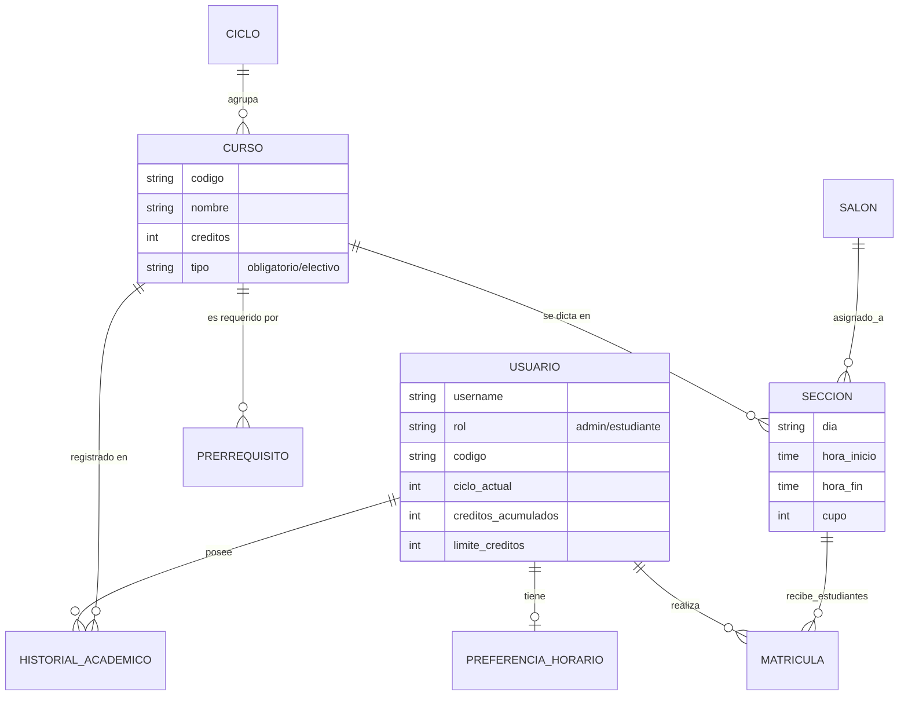
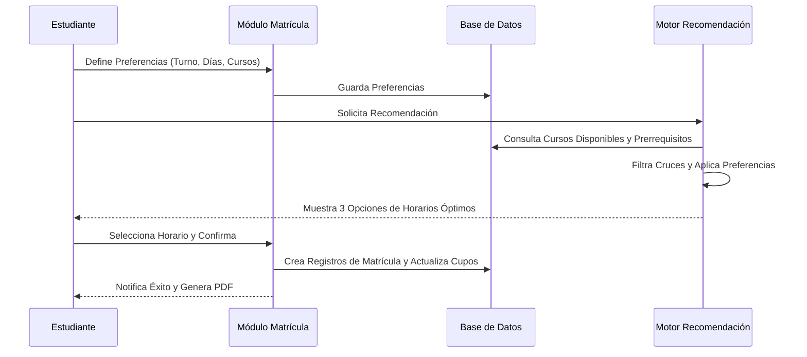

# Arquitectura Detallada del Sistema SIMA

Este documento describe la arquitectura técnica del **Sistema de Información y Matrícula Académica (SIMA)**, una plataforma integral diseñada para la gestión académica, matrícula inteligente y administración de estudiantes.

---

## 1. Descripción General de la Infraestructura

| Capa | Tecnología | Versión |
|------|-------------|----------|
| Frontend | React + Vite | 19.x / 8.x |
| Gráficos | Chart.js + react-chartjs-2 | 4.x / 5.x |
| HTTP Client | axios | 1.x |
| Routing | react-router-dom | 7.x |
| Backend | Node.js + Express | 18+ / 4.x |
| ORM | Mongoose | 8.x |
| Base de Datos | MongoDB | 6+ |
| Autenticación | JWT + bcryptjs | — |
| Compresión | compression | 1.x |

---

## 2. Capa de Datos (Modelado E-R)
La base de datos está normalizada para manejar la complejidad de los prerrequisitos y cruces de horarios.

---

## 3. Capa de Lógica y Seguridad
### 3.1. Autenticación JWT (Hybrid Middleware)
El sistema utiliza un enfoque híbrido de seguridad:
1. **Token JWT:** Se almacena en las `COOKIES` del navegador como `access_token`.
2. **Middleware:** El `JWTMiddleware` intercepta cada petición, decodifica el token usando la `SECRET_KEY` del sistema y autentica automáticamente al usuario en la sesión de Django (`request.user`).
3. **Roles:** El modelo de usuario extendido permite diferenciar vistas y permisos entre `Administrador` y `Estudiante`.

### 3.2. Motor de Recomendación (IA)
Ubicado en `matricula/utils.py`, el motor utiliza algoritmos de filtrado y búsqueda de caminos para generar horarios óptimos:
- **Validación de Prerrequisitos:** Verifica que el estudiante haya aprobado los cursos necesarios o tenga los créditos mínimos.
- **Detección de Cruces:** Algoritmo que compara intervalos de tiempo `(hora_inicio, hora_fin)` en el mismo día para evitar superposiciones.
- **Optimización de Preferencias:** Filtra secciones basadas en el turno preferido (mañana/tarde/noche), cantidad máxima de días y carga crediticia deseada.

---

## 4. Estructura de Aplicaciones (Componentes)

| Aplicación | Responsabilidad |
| :--- | :--- |
| `usuarios` | Gestión de perfiles, autenticación JWT, dashboard principal y panel administrativo de estudiantes. |
| `academico` | Core de datos: Cursos, Ciclos, Salones, Secciones e Historial Académico (Notas). |
| `matricula` | Lógica de inscripción, gestión de preferencias del estudiante y motor de horarios recomendados. |
| `core` | Configuraciones globales del proyecto, variables de entorno y enrutamiento principal. |

---

## 5. Capa de Presentación (UI/UX)
El frontend está diseñado con una estética **Premium** y **Moderna**:
- **Estilizado:** Vanilla CSS con un sistema de variables para el tema (Purple & White).
- **Interactividad:** Diseño responsivo, micro-animaciones en botones y tarjetas, y estados de hover dinámicos.
- **Visualización:** 
    - Dashboard dinámico para estudiantes.
    - Tabla de horario visual (Grid interactivo).
    - Panel de administración simplificado para gestión de recursos.

---

## 6. Flujo de Matrícula Inteligente

---

## 7. Características de Seguridad y Rendimiento
- **Strict SQL Mode:** Asegura que no se inserten datos truncados o inválidos en MySQL.
- **Optimización de Consultas:** Uso de `select_related` y `prefetch_related` para minimizar las consultas a la base de datos (N+1 problem).
- **Restricciones Académicas:** Validación en servidor de límites de créditos y penalizaciones por cursos desaprobados.
