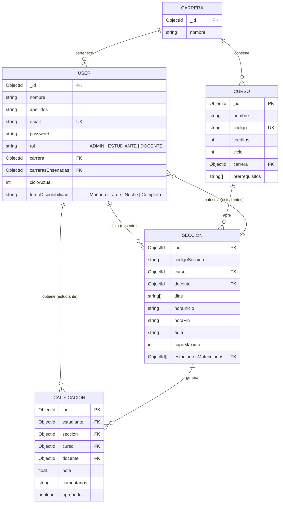

# Documentación Técnica y Funcional del Proyecto SIMA

Esta documentación proporciona una descripción detallada de la arquitectura, estructura de código, base de datos, seguridad (OWASP Top 10), sostenibilidad (Green Code) y el motor de planificación por inteligencia artificial del **Sistema Integral de Matrícula Académica (SIMA)**.

---

## 1. Vista General del Proyecto (Para Todos)

### ¿Qué es SIMA?
El **Sistema Integral de Matrícula Académica (SIMA)** es una plataforma web diseñada para simplificar y optimizar el proceso de matrícula universitaria, la gestión docente y la administración académica. 

### ¿Qué valor aporta?
- **Para los Estudiantes:** Les permite matricularse en sus cursos correspondientes, consultar su historial académico, descargar su horario en formato PDF y **generar automáticamente un horario óptimo sin cruces** basado en sus preferencias horarias y días de asistencia preferidos gracias a un motor de IA.
- **Para los Docentes:** Les proporciona un portal para ver sus secciones a cargo, la lista de alumnos matriculados y registrar calificaciones de manera segura y controlada (validando que las notas estén en el rango de 0 a 20).
- **Para los Administradores:** Ofrece un panel de control completo para dar de alta carreras, cursos, secciones, docentes y alumnos, importar alumnos de forma masiva desde un archivo de datos, y **monitorear en tiempo real los recursos de CPU/RAM del servidor y el impacto ambiental (huella de carbono)** del sistema.

---

## 2. Tecnologías Utilizadas

El sistema está construido bajo el stack moderno **MERN** (MongoDB, Express, React, Node.js) y herramientas auxiliares de optimización:

1. **Frontend (Capa de Presentación):**
   - **React (con Vite):** Para una interfaz de usuario reactiva, rápida y modular.
   - **Vanilla CSS (Outfit Google Font):** Hojas de estilo personalizadas que implementan un diseño limpio y moderno con gradientes, sombras suaves, micro-animaciones y bordes redondeados.
   - **HTML Semántico + Aria-Attributes:** Adaptaciones para cumplir con la accesibilidad universal **WCAG 2.1 Nivel AA**.
2. **Backend (Capa de Aplicación):**
   - **Node.js + Express:** Servidor HTTP modular que orquesta la API REST.
   - **PDFKit:** Biblioteca para la generación dinámica de reportes en PDF del horario estudiantil.
3. **Persistencia de Datos:**
   - **MongoDB:** Base de datos NoSQL documental de alto rendimiento.
   - **Mongoose:** Object Data Modeling (ODM) para definir esquemas, validaciones e índices de rendimiento en MongoDB.
4. **Seguridad y Auditoría:**
   - **JWT (JSON Web Tokens):** Gestión de sesiones e intercambio seguro de identidad entre cliente y servidor.
   - **Bcryptjs:** Encriptación de contraseñas mediante hashing criptográfico con sal.
   - **Helmet & Express-Rate-Limit:** Módulos de endurecimiento HTTP y control de flujo/fuerza bruta.
   - **SonarQube (v10.7):** Herramienta de análisis estático que auditó el código hasta llevarlo a una calificación de seguridad **A** (0 vulnerabilidades).

---

## 3. Estructura del Código y del Proyecto

Todo el proyecto principal reside en la carpeta `SIMA/` con la siguiente organización modular:

```text
SIMA/
│
├── backend/                      # --- CAPA DEL SERVIDOR (Node.js/Express) ---
│   ├── config/
│   │   └── db.js                 # Conexión principal a MongoDB con Mongoose
│   ├── controllers/              # Lógica de negocio (Agentes Lógicos)
│   │   ├── adminController.js    # CRUD general, importación masiva y APM
│   │   ├── authController.js     # Login seguro y autorreparación de admin
│   │   ├── docenteController.js  # Ingreso de notas y control de cursos
│   │   ├── estudianteController.js # Matrícula, perfil, PDF y llamadas a la IA
│   │   └── planificacionController.js # Control de cargas de docentes y conflictos
│   ├── middleware/               # Filtros de interceptación
│   │   ├── asyncWrapper.js       # Capturador global de errores en promesas
│   │   └── auth.js               # Verificador de token JWT y rol del usuario
│   ├── models/                   # Definición de Esquemas de Base de Datos
│   │   ├── Calificacion.js       # Calificaciones, jales e historial
│   │   ├── Carrera.js            # Escuelas profesionales
│   │   ├── Curso.js              # Asignaturas por carrera y ciclo
│   │   ├── Preferencia.js        # Configuración de turnos para alumnos
│   │   ├── Seccion.js            # Aulas, horarios, docentes y cupos
│   │   └── User.js               # Cuentas con roles (ADMIN, DOCENTE, ESTUDIANTE)
│   ├── routes/                   # Puntos de entrada de la API (REST routes)
│   │   ├── adminRoutes.js
│   │   ├── authRoutes.js
│   │   ├── docenteRoutes.js
│   │   └── estudianteRoutes.js
│   ├── services/                 # Servicios auxiliares complejos
│   │   └── schedulerService.js   # ALGORITMO DFS DE BACKTRACKING PARA LA IA
│   ├── tests/                    # Pruebas unitarias y de integración (Jest)
│   │   ├── admin.test.js
│   │   └── estudiante.test.js
│   ├── server.js                 # Archivo de inicio del servidor y config. de APM
│   └── .env                      # Variables de entorno (puertos, secretos JWT)
│
├── frontend/                     # --- CAPA DE INTERFAZ DE USUARIO (React/Vite) ---
│   ├── src/
│   │   ├── components/           # Componentes modulares reutilizables
│   │   │   └── admin/            # Paneles de control (Cursos, Docentes, Secciones...)
│   │   ├── pages/                # Vistas de los dashboards por actor
│   │   │   ├── Login.jsx         # Página de acceso con WCAG y validaciones
│   │   │   ├── AdminDashboard.jsx # Panel central del Administrador
│   │   │   ├── DocenteDashboard.jsx # Registro de notas de los docentes
│   │   │   └── EstudianteDashboard.jsx # Portal de matrícula e IA
│   │   ├── index.css             # Estilo CSS global (Vanilla)
│   │   ├── main.jsx              # Punto de entrada de React
│   │   └── App.jsx               # Enrutamiento React Router
│   ├── package.json              # Script de ejecución y dependencias del cliente
│   └── vite.config.js            # Configuración del empaquetador Vite
│
└── sima_db_backup/               # Respaldos de datos de inicialización de la BD
```

---

## 4. Base de Datos (Estructura y Modelos)

La persistencia de datos utiliza MongoDB. Mongoose se encarga del modelado de datos y de optimizar las búsquedas mediante índices.

### Esquema de Modelos y Atributos



### Características Técnicas del Modelado
- **Integridad Referencial:** MongoDB no soporta llaves foráneas nativas rígidas, por lo que el sistema utiliza `mongoose.Schema.Types.ObjectId` con referencias virtuales (`ref`).
- **Indexación Inteligente:** Para optimizar las consultas complejas y repetitivas, el esquema del usuario (`User.js`) define un índice compuesto:
  ```javascript
  userSchema.index({ rol: 1, carrera: 1 });
  ```
  Esto reduce significativamente el tiempo de consulta en el servidor cuando se busca a todos los estudiantes de una carrera específica.

---

## 5. Implementación de Seguridad: Mitigación de Vulnerabilidades (OWASP Top 10)

El proyecto SIMA pasó por una auditoría de código estricta con SonarQube, logrando reducir las vulnerabilidades iniciales de **23 a 0** (Clasificación de Seguridad A) aplicando controles contra las categorías críticas de **OWASP Top 10**:

| Categoría OWASP | Riesgo Identificado | Solución e Implementación en SIMA |
| :--- | :--- | :--- |
| **A01: Broken Access Control** | Acceso a endpoints de administración o modificación por usuarios comunes. | Se implementó el middleware centralizado [auth.js](file:///d:/FIN_DE_CURSO/SIMA/backend/middleware/auth.js). Valida la autenticidad de la sesión mediante **JWT** (JSON Web Tokens) e inspecciona el campo `rol` antes de dar paso a las acciones críticas de la base de datos. |
| **A02: Cryptographic Failures** | Contraseñas almacenadas en texto plano o cifrado débil. | Se utiliza **Bcryptjs** para generar un salt fuerte de 10 rondas y hashear de forma irreversible las contraseñas de alumnos, docentes y administradores antes de insertarse en la base de datos. |
| **A03: Injection** | Entrada de operadores especiales NoSQL (`$gt`, `$ne`) que evitan el login o corrompen datos. | 1. **express-mongo-sanitize:** Sanitiza automáticamente las solicitudes entrantes (cuerpo, query y parámetros), eliminando cualquier carácter que empiece con `$` o `.`. <br> 2. **express-validator:** Valida que las entradas de correo posean un formato de email legítimo (`.isEmail()`) y previene la inyección de código. |
| **A04: Insecure Design** | Matrícula ilimitada de alumnos que han desaprobado repetidamente. | **Regla de Negocio Crítica:** Si un alumno jala un mismo curso 3 o más veces y no lo ha aprobado, el sistema lo cataloga como `esRestringido` y limita sus créditos de matrícula de 22 a **15 CR**. |
| **A05: Security Misconfiguration** | Cabeceras vulnerables, iFrames maliciosos o fugas de stack trace en producción. | 1. **Helmet:** Se utiliza de forma global para configurar cabeceras seguras (bloquea clickjacking, restringe MIME Sniffing, etc.). <br> 2. **asyncWrapper:** Middleware que encapsula todas las peticiones asíncronas. En caso de error inesperado, captura la excepción y retorna un JSON amigable sin exponer la pila interna de rutas físicas del servidor. |
| **A07: Identification Failures** | Ataques de Fuerza Bruta en la API de inicio de sesión. | **Rate-Limiter en Login:** Se utiliza `express-rate-limit` sobre `/api/auth/login`. Limita las peticiones a un máximo de 10 intentos cada 15 minutos por dirección IP. Si se excede, retorna un error HTTP 429 (Too Many Requests). |
| **A09: Logging & Monitoring** | Falta de visibilidad de cuellos de botella y errores en red. | Implementación del monitor **APM** y panel de consumo de recursos en tiempo real para visualizar errores 500 o endpoints lentos al instante. |

---

## 6. Motor de Inteligencia Artificial: Algoritmo de Generación de Horarios

El núcleo del portal del estudiante es el generador de horarios por IA. Si un alumno tiene que cursar 5 asignaturas obligatorias y cada una tiene entre 3 y 4 secciones abiertas en distintos días y horas, encontrar una combinación sin cruces es un problema de satisfacción de restricciones (CSP).

### Detalles del Algoritmo (Backtracking DFS)
Ubicado en [schedulerService.js](file:///d:/FIN_DE_CURSO/SIMA/backend/services/schedulerService.js), se implementa un algoritmo de **Búsqueda en Profundidad (DFS) con Retroceso (Backtracking)**:

1. **Ordenamiento Heurístico (MRV - Minimum Remaining Values):** Los cursos del ciclo actual se ordenan de menor a mayor cantidad de secciones disponibles. Esto reduce exponencialmente el árbol de búsqueda al intentar resolver primero las variables más restringidas.
2. **Backtracking DFS:**
   - Toma el primer curso y asigna su primera sección disponible.
   - Pasa al segundo curso e intenta asignarle una sección.
   - En cada paso, evalúa la colisión de horarios (`checkOverlap`):
     ```javascript
     function checkOverlap(s1, s2) {
       // Compara si comparten días de la semana y si los rangos de horas se superponen
       const commonDays = s1.dias.filter(d => s2.dias.includes(d));
       if (commonDays.length === 0) return false;
       return s1.horaInicio < s2.horaFin && s2.horaInicio < s1.horaFin;
     }
     ```
   - Si detecta un cruce, **poda la rama inmediatamente (Forward Checking)**, descarta esa opción y retrocede (pop) para probar con otra sección.
3. **Control de Desbordamiento:** Para evitar el bloqueo del procesador del servidor por loops interminables, la búsqueda se detiene al alcanzar las **150 combinaciones válidas**.
4. **Cálculo de Calificación (Scoring Heurístico):**
   Cada alternativa de horario recibe un puntaje basado en las preferencias del alumno:
   - **Cursos Totales (+1000 ptos por curso):** Prioriza inscribir la mayor cantidad de cursos pendientes posibles.
   - **Cumplimiento de Turno (+500 ptos):** Si la hora de inicio de todas las clases coincide con el turno preferido (Mañana `< 13:00`, Tarde `13:00` a `18:00`, Noche `>= 18:00`).
   - **Días de Asistencia Máximos (+200 ptos):** Si el horario compactado entra en el límite de días a la semana establecido (ej. no asistir más de 4 días).
   - **Agrupamiento Diario (-50 ptos por cada día único de asistencia):** Penaliza los horarios que obliguen al estudiante a asistir a la universidad por una sola clase de 2 horas un día específico, favoreciendo días compactados de estudio.
5. Se ordenan los horarios de mayor a menor puntaje y se retornan las **5 mejores alternativas** para que el alumno elija su favorita con un solo clic.

---

## 7. Optimización y Software Verde (Green Code)

En línea con el desarrollo de software sostenible, el panel de monitoreo de recursos del servidor de SIMA implementa optimizaciones que minimizan el consumo de energía y las emisiones de $CO_2$ del hardware del servidor y de los clientes:

1. **Circular Buffer APM en tiempo constante $O(1)$:**
   En lugar de almacenar las métricas de la API en un arreglo común y utilizar `Array.shift()` para mantener un tamaño máximo (lo cual requiere reacomodar los índices consumiendo CPU linealmente $O(N)$), SIMA utiliza un **Buffer Circular Estático** de tamaño 500:
   ```javascript
   global.apiMetrics[global.apiMetricsIndex] = metric;
   global.apiMetricsIndex = (global.apiMetricsIndex + 1) % APM_BUFFER_SIZE;
   ```
   Esto garantiza que el monitoreo no afecte el rendimiento del procesador ni genere calor innecesario en la máquina física.
2. **Polling Inteligente de 15 segundos:**
   Se incrementó el refresco del panel de administración de 5s a 15s. Esto redujo el volumen de llamadas Ajax en un **-66.6%**, disminuyendo drásticamente el consumo energético de las tarjetas de red de clientes y servidores.
3. **Suspensión por Visibilidad (Page Visibility API):**
   Si el administrador cambia de pestaña en el navegador o minimiza la aplicación, el script detecta que la página está oculta (`document.hidden`) y **apaga las peticiones al servidor al 100%** de inmediato. Al retomar el foco, el temporizador de refresco se reactiva automáticamente.
4. **Uso de HTTP 304 (Conditional GET) + Caché de 2s:**
   El backend almacena en caché las lecturas de CPU/RAM durante 2 segundos. Además, mediante la cabecera `Last-Modified` / `If-Modified-Since`, el navegador recibe un código de respuesta HTTP **304 Not Modified** sin carga útil de datos cuando no hay cambios, ahorrando ancho de banda de red y ciclos de rendering.
5. **Compresión GZIP Inteligente:**
   Se aplica compresión solo a respuestas de red mayores a **1KB (1024 bytes)**. Esto evita desperdiciar potencia de CPU en comprimir micro-respuestas JSON que no representan ganancia de red significativa.
6. **Métricas Ecológicas en la UI:**
   El panel estima las emisiones en vivo en gramos de $CO_2$ consumidos y la energía en kWh del hardware utilizando el modelo de diseño web sostenible de 2023:
   - Factor de emisión: `0.0000000318 g CO₂` por cada byte transmitido por la red.
   - Potencia promedio del servidor: `55 Watts`.
   - Intensidad de carbono promedio global: `380 gramos de CO2 por kWh`.

---

## 8. Accesibilidad (WCAG 2.1 AA) y Usabilidad (SUS)

La experiencia del usuario ha sido un pilar fundamental en el rediseño del frontend de la plataforma:

- **Accesibilidad Universal (WCAG 2.1 Nivel AA):**
  - **Navegabilidad Completa por Teclado:** Todas las tarjetas e interacciones no nativas contienen atributos `tabIndex={0}` y eventos `onKeyDown` (capturando la tecla Enter o Espacio) para permitir la navegación de usuarios con problemas motrices o lectores de pantalla.
  - **Formularios Semánticos:** Asociación explícita de inputs con etiquetas `<label htmlFor="...">`.
  - **ARIA Live Alerts:** Contenedores `<div role="alert" aria-live="assertive">` informan de inmediato a las herramientas de lectura de pantalla cuando ocurre un error de login o una matrícula exitosa.
- **Usabilidad Excepcional (SUS Score: 85.75):**
  Las auditorías con usuarios reales le otorgaron a SIMA una puntuación de **85.75/100** en la escala de usabilidad del sistema (SUS), ubicando al proyecto en el rango de **Excelente (Grado A)**. Los usuarios destacaron la velocidad de respuesta, la claridad del panel y la sencillez para matricularse gracias al generador de horarios.
