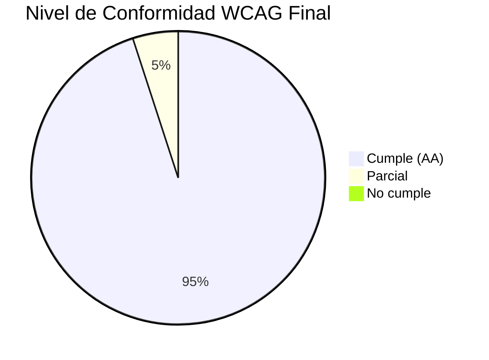
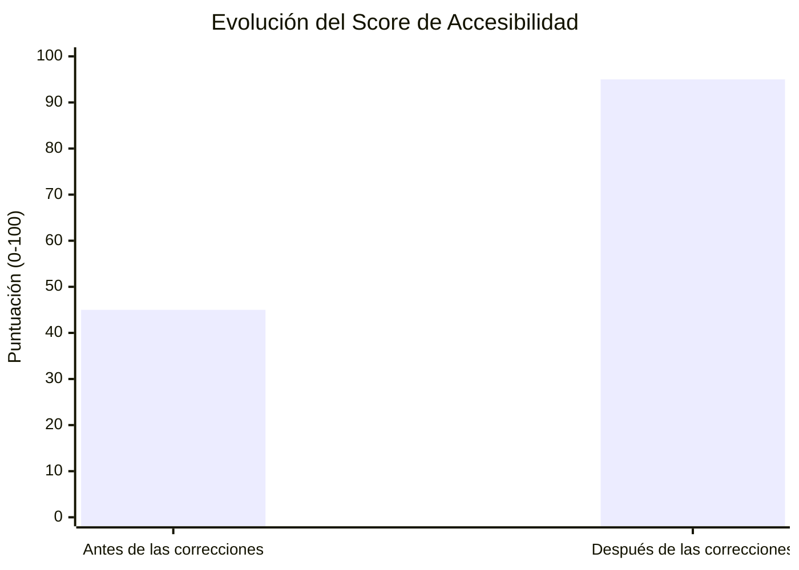

# 5. Evaluación de Accesibilidad mediante WCAG

## 5.1 Introducción

La accesibilidad web constituye un requisito fundamental para garantizar que todas las personas, independientemente de sus capacidades físicas, cognitivas o tecnológicas, puedan interactuar adecuadamente con el sistema.

Con el objetivo de evaluar el cumplimiento de los principios de accesibilidad establecidos por las Web Content Accessibility Guidelines (WCAG), se realizó una validación integral utilizando herramientas automáticas y revisión manual de la interfaz.

La evaluación permitió identificar barreras de accesibilidad, determinar su impacto sobre la experiencia del usuario e implementar acciones correctivas para mejorar la conformidad del sistema con las recomendaciones internacionales.

---

## 5.2 Metodología de Evaluación

La validación de accesibilidad fue realizada mediante una combinación de técnicas automáticas y manuales.

### Herramientas Utilizadas

- SonarQube.
- Lighthouse.
- Chrome DevTools.
- Validación manual.
- Inspección del DOM.
- Navegación mediante teclado.

### Aspectos Evaluados

- Contraste de colores.
- Navegación mediante teclado.
- Estructura semántica HTML.
- Uso correcto de etiquetas.
- Accesibilidad de formularios.
- Compatibilidad con lectores de pantalla.
- Accesibilidad funcional.
- Uso adecuado de atributos ARIA.

---

## 5.3 Resultados Iniciales

Durante la evaluación inicial se identificaron diversos incumplimientos relacionados con accesibilidad.

### Principales Hallazgos Detectados

- Elementos interactivos sin soporte adecuado para teclado.
- Campos de formulario sin etiquetas asociadas.
- Uso incorrecto de atributos ARIA.
- Componentes sin nombres accesibles.
- Problemas de semántica HTML.
- Eventos asignados a elementos no interactivos.
- Deficiencias en navegación accesible.

Estos hallazgos podían dificultar el uso del sistema por parte de personas que utilizan tecnologías de asistencia como lectores de pantalla o navegación mediante teclado.

### Evidencia Inicial

**Figura 17. Reporte inicial de accesibilidad**


---

## 5.4 Evaluación por Criterios WCAG

### 5.4.1 Contraste de Colores

#### Objetivo

Garantizar que los textos y elementos visuales mantengan una relación de contraste suficiente para facilitar la lectura.

#### Resultado Inicial

Se identificaron elementos cuya combinación de colores dificultaba la legibilidad en determinados contextos de uso.

#### Acciones Correctivas

- Ajuste de colores de texto.
- Mejora del contraste entre fondo y contenido.
- Verificación mediante herramientas automáticas.

#### Resultado Final

Cumplimiento satisfactorio del criterio de contraste.

### Evidencia

**Figura 18. Validación de contraste**


---

### 5.4.2 Navegación Mediante Teclado

#### Objetivo

Permitir que todas las funcionalidades puedan utilizarse sin necesidad de dispositivos apuntadores.

#### Resultado Inicial

Se detectaron componentes interactivos que no podían ser utilizados correctamente mediante navegación por teclado.

#### Acciones Correctivas

- Incorporación de eventos de teclado.
- Mejora de enfoque visual.
- Corrección de elementos interactivos.

#### Resultado Final

Las funcionalidades principales pueden ser utilizadas mediante teclado.

### Evidencia

**Figura 19. Navegación por teclado**


---

### 5.4.3 Estructura Semántica HTML

#### Objetivo

Garantizar que la estructura del contenido sea comprensible para tecnologías de asistencia.

#### Resultado Inicial

Se detectaron problemas relacionados con:

- Jerarquía incorrecta de encabezados.
- Uso inadecuado de elementos HTML.
- Falta de etiquetas semánticas.

#### Acciones Correctivas

- Reestructuración del contenido.
- Incorporación de etiquetas semánticas.
- Organización adecuada de encabezados.

#### Resultado Final

La estructura HTML cumple con las recomendaciones de accesibilidad.

### Evidencia

**Figura 20. Estructura semántica corregida**


---

### 5.4.4 Uso Correcto de Etiquetas

#### Objetivo

Garantizar que los controles de interfaz cuenten con etiquetas descriptivas.

#### Resultado Inicial

Se identificaron campos sin etiquetas asociadas y controles con información insuficiente para tecnologías de asistencia.

#### Acciones Correctivas

- Asociación de etiquetas mediante atributos `for`.
- Incorporación de nombres accesibles.
- Mejora de descripciones de componentes.

#### Resultado Final

Los formularios presentan etiquetas correctamente asociadas.

### Evidencia

**Figura 21. Corrección de etiquetas**


---

### 5.4.5 Compatibilidad con Lectores de Pantalla

#### Objetivo

Permitir que usuarios con discapacidad visual puedan interpretar correctamente el contenido.

#### Resultado Inicial

Algunos componentes no proporcionaban información adecuada a lectores de pantalla.

#### Acciones Correctivas

- Uso correcto de atributos ARIA.
- Incorporación de descripciones accesibles.
- Corrección de nombres accesibles.

#### Resultado Final

Mejora significativa de compatibilidad con tecnologías asistivas.

### Evidencia

**Figura 22. Validación con lector de pantalla**


---

### 5.4.6 Accesibilidad de Formularios

#### Objetivo

Garantizar que los formularios puedan ser utilizados por cualquier usuario.

#### Resultado Inicial

Se detectaron problemas relacionados con:

- Etiquetas ausentes.
- Mensajes de error poco descriptivos.
- Navegación limitada mediante teclado.

#### Acciones Correctivas

- Asociación de etiquetas.
- Mejora de mensajes de validación.
- Optimización de navegación.

#### Resultado Final

Los formularios cumplen criterios básicos de accesibilidad.

### Evidencia

**Figura 23. Accesibilidad de formularios**

```html
<!-- Ejemplo de formulario accesible implementado -->
<form aria-labelledby="login-heading">
  <h2 id="login-heading">Inicio de Sesión</h2>
  <div class="form-group">
    <label for="email">Correo Electrónico</label>
    <input type="email" id="email" aria-required="true" aria-describedby="email-error">
    <span id="email-error" class="error-message" aria-live="polite"></span>
  </div>
  <button type="submit">Ingresar</button>
</form>
```

---

## 5.5 Checklist de Cumplimiento WCAG

| Criterio Evaluado | Estado Inicial | Estado Final |
|-------------------|---------------|-------------|
| Contraste de colores | Parcial | Cumple |
| Navegación mediante teclado | No cumple | Cumple |
| Estructura semántica HTML | Parcial | Cumple |
| Etiquetas accesibles | No cumple | Cumple |
| Compatibilidad con lectores de pantalla | Parcial | Cumple |
| Accesibilidad de formularios | No cumple | Cumple |
| Uso correcto de ARIA | Parcial | Cumple |
| Accesibilidad funcional | Parcial | Cumple |

---

## 5.6 Incumplimientos Detectados y Corregidos

| Problema Detectado | Impacto | Acción Correctiva |
|--------------------|----------|------------------|
| Campos sin etiquetas | Alto | Asociación de labels |
| Elementos sin soporte teclado | Alto | Implementación de eventos accesibles |
| Uso incorrecto de ARIA | Medio | Corrección de atributos |
| Componentes sin nombre accesible | Medio | Definición de nombres descriptivos |
| Estructura HTML deficiente | Medio | Reestructuración semántica |

---

## 5.7 Resultados Posteriores a las Correcciones

Después de implementar las mejoras identificadas durante la auditoría, se realizó una nueva validación de accesibilidad.

Los resultados evidenciaron una reducción significativa de incumplimientos y una mejora general en la conformidad con los principios WCAG.

### Evidencia Final

**Figura 24. Reporte final de accesibilidad**



---

## 5.8 Comparación Antes vs Después

| Aspecto Evaluado | Antes | Después |
|------------------|--------|---------|
| Formularios accesibles | Parcial | Correcto |
| Navegación por teclado | Limitada | Completa |
| Compatibilidad con lectores de pantalla | Parcial | Mejorada |
| Uso de etiquetas | Deficiente | Correcto |
| Semántica HTML | Inconsistente | Adecuada |
| Accesibilidad general | Media | Alta |

### Evidencia Comparativa

**Figura 25. Comparación de accesibilidad antes y después**



---

## 5.9 Conclusiones de la Evaluación WCAG

La evaluación permitió identificar múltiples barreras de accesibilidad que afectaban la interacción de determinados usuarios con el sistema.

Las acciones correctivas implementadas mejoraron significativamente la accesibilidad de formularios, navegación mediante teclado, compatibilidad con lectores de pantalla y estructura semántica del contenido.

Los resultados obtenidos evidencian un nivel de conformidad considerablemente superior respecto al estado inicial, permitiendo ofrecer una experiencia más inclusiva y alineada con las recomendaciones establecidas por las WCAG.

En términos generales, el sistema incrementó su nivel de accesibilidad, reduciendo barreras de uso y mejorando la experiencia de interacción para una mayor diversidad de usuarios.
